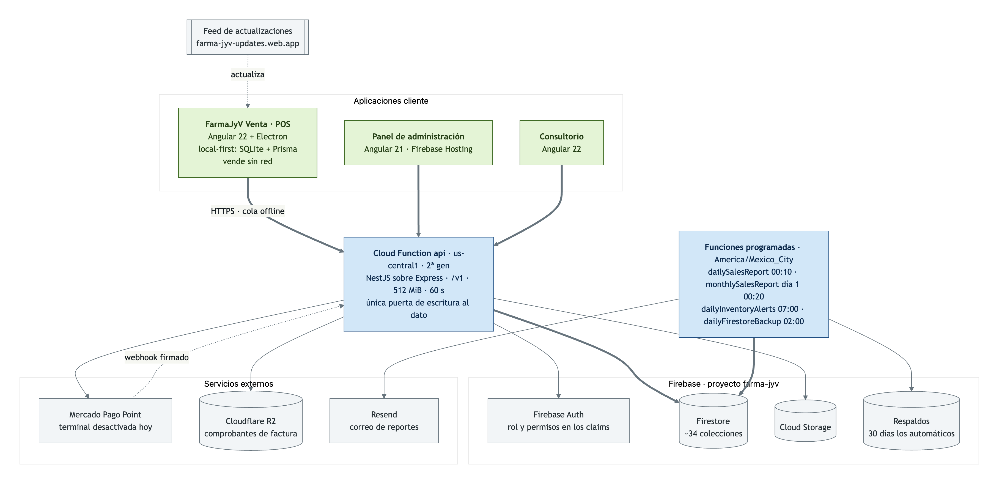
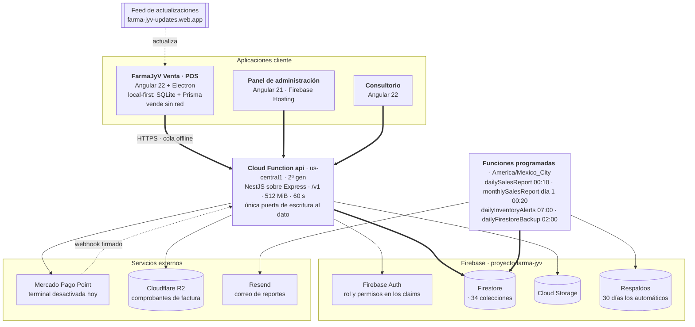

# Dosier técnico — API FarmaJyV

API REST de la farmacia: NestJS sobre Express, empaquetada como una Cloud
Function de 2ª generación. Es **la única puerta de escritura al dato**: las
reglas de Firestore niegan toda escritura de cliente, así que ni el POS, ni el
panel, ni el consultorio tocan la base directamente.

Documento generado a partir del código en `feature/medic-changes`
(2026-09-16). Para la operación del día a día —desplegar, respaldar, restaurar,
rotar secretos— ver [`RUNBOOK.md`](../RUNBOOK.md).

---

## 1. El sistema alrededor



La fuente del diagrama está en [`arquitectura.mmd`](arquitectura.mmd); GitHub
dibuja el bloque de abajo, y el PNG se regenera desde el mismo archivo.



---

## 2. Panorama

| Dato | Valor |
|---|---|
| Runtime | Node 22 · Cloud Functions 2ª gen (Cloud Run por debajo) |
| Framework | NestJS 11 sobre Express 5, montado en una sola función HTTP |
| Región | `us-central1` |
| Recursos de `api` | 512 MiB · 60 s de timeout |
| Prefijo | `/v1` — URL pública `https://api-vykfsskx3q-uc.a.run.app/v1` |
| Validación | Zod (`schemas/`) vía `ZodValidationPipe`; nunca se confía en el cuerpo |
| Datos | Firestore (~34 colecciones) · Cloud Storage · Cloudflare R2 |
| Correo | Resend |
| Pagos | Mercado Pago Point (órdenes + webhook firmado) |
| Tamaño | ~28 500 líneas, 171 archivos fuente |
| Pruebas | Jest contra el **emulador de Firestore**: 40 suites, **679** casos (`npm test`); las reglas van aparte (`npm run test:rules`) |

### Las cinco funciones desplegadas

| Función | Disparo | Qué hace |
|---|---|---|
| `api` | HTTP | Toda la API REST |
| `dailySalesReport` | 00:10 diario | Reporte de ventas del día por correo |
| `monthlySalesReport` | día 1, 00:20 | Reporte mensual |
| `dailyInventoryAlerts` | 07:00 diario | Caducidades y mínimos de stock |
| `dailyFirestoreBackup` | 02:00 diario | Volcado a Cloud Storage, 30 días de retención |

Los horarios son de `America/Mexico_City`, no UTC: un reporte "del día" tiene
que cerrar con el día de la farmacia.

### Arranque en frío

`index.ts` cachea el bootstrap de Nest entre invocaciones calientes, pero **no
cachea el rechazo**: si `createApp()` falla (Firestore intermitente, un provider
que revienta), guardar la promesa rechazada dejaba a esa instancia contestando
el mismo error a todas las peticiones siguientes hasta que Cloud Run la
reciclara. Al limpiarla, el request siguiente reintenta el arranque.

---

## 3. Estructura

```
functions/src/
  index.ts          las 5 funciones exportadas; caché del bootstrap
  app.ts            Express + Nest: CORS, parser JSON, filtro de errores
  app.module.ts     módulos de Nest
  modules/          un directorio por área: controladores y módulos
  services/         reglas de negocio (39 servicios)
  repositories/     acceso a Firestore (29 repositorios)
  schemas/          Zod: la forma de todo lo que entra
  middleware/       CORS
  schedules/        funciones programadas
  utils/            errores, firestore, dinero, storage, r2, gs1
  constants/        permisos
test/               48 archivos de prueba contra el emulador
```

La regla: **controlador → servicio → repositorio**. El controlador valida y
autoriza; el servicio decide; el repositorio habla con Firestore. Un servicio no
toca `firestore()` salvo para transacciones que cruzan repositorios (ventas,
idempotencia).

---

## 4. Autenticación y permisos

1. El cliente manda el **ID token de Firebase** en `Authorization: Bearer`.
2. `AuthGuard` lo verifica y carga el usuario con su rol.
3. `PermissionsGuard` compara contra el decorador `@RequirePermission(area, nivel)`.

El rol vive en Firestore (colección `roles`) y sus permisos viajan además en los
**custom claims**, con `permissionsVersion` para forzar la reemisión cuando el
rol cambia de alcance.

Áreas de permiso (`constants/permissions.ts`): `dashboard`, `users`, `sales`,
`categories`, `products`, `suppliers`, `inventory`, `invoices`, `uploads`,
`doctor`, `patients`, `medicalRecords`, `appointments`, `pos`, `directCharges`,
`stockEntry`, `cashSessions`, `expenses`, `pharmacyServices`. Cada una con nivel
`read` o `write`; `admin` pasa siempre.

Dos detalles que no se ven en el código a primera vista:

- **`POST /sales/:id/void` pide solo `sales:read`.** El decorador admite un área
  y aquí valen dos: quien anula puede ser el mostrador (`pos:write`) o la
  administración (`sales:write`). La decisión real la toma
  `assertCanVoidSale` dentro del servicio. Con `RequirePermission('sales')` el
  guard rechazaba al cajero con 403 antes de llegar al handler.
- **Un turno de caja es de quien lo abrió.** `assertCanAccessSession` lo impone
  y se exporta a propósito: `sales.service` y `sale-returns.service` aplican la
  misma regla, porque sin ella un cajero carga efectivo al turno de otro y le
  deja el faltante en su corte.

---

## 5. Reglas de dinero

Todo lo que toca importes vive en el servidor y se recalcula aquí: el cliente
propone partidas, **no totales**.

- **Centavos, no flotantes.** Las comparaciones van por `toCents`; los importes
  que salen a pantalla o a ticket se redondean a dos decimales. El corte se suma
  partida por partida y sin redondear salen cifras tipo `439.99999999999994`.
- **Impuestos incluidos en el precio** (mercado mexicano): IEPS sobre la base,
  IVA sobre base+IEPS, y el sobrante se absorbe en la base para que la suma
  cuadre al centavo.
- **Descuento máximo por rol**: `MAX_NON_ADMIN_DISCOUNT_RATE`. Si el POS deja
  pasar más, el backend rechaza la venta.
- **Precio cobrado sobre precio de catálogo.** La partida puede traer
  `unitPrice`; el backend lo respeta y anota `catalogUnitPrice` cuando difiere.
  Sin esto, una venta offline de las 11:00 se retarifaba al sincronizar si el
  precio cambió a la 13:00, y se rechazaba con "el monto recibido es menor al
  total" — con el dinero ya en el cajón.

### Idempotencia

Dos colecciones de llaves, mismo patrón: documento `usuario:llave`, reservado
**antes** de tocar nada.

| Colección | Cubre |
|---|---|
| `saleIdempotencyKeys` | `POST /sales` y `/sales/bulk` |
| `stockEntryIdempotencyKeys` | `POST /stock-entries` |

En ventas, la llave se compara además contra una huella del cuerpo
(`requestFingerprint`): la misma llave con otro contenido es un error del
cliente, no un reintento. En entradas de stock, una llave reservada que quedó a
medias responde **409** y pide revisión humana: duplicar existencias es peor que
pedir que alguien mire.

---

## 6. Firestore

~34 colecciones. Las que sostienen la operación diaria:

| Colección | Para qué |
|---|---|
| `sales`, `saleReturns`, `unreconciledSales` | Ventas, devoluciones y ventas cobradas que el servidor rechazó |
| `cashSessions`, `cashMovements`, `cashReadings` | Turnos, gastos/retiros y lecturas X |
| `products`, `batches`, `stockMovements`, `inventoryEntries`, `inventoryCounts` | Catálogo e inventario por lote |
| `controlledSalesLedger` | Libro de control COFEPRIS |
| `pharmacyServices`, `serviceProviders` | Servicios y quién los presta |
| `invoices`, `suppliers`, `supplierPayments` | Compras y cuentas por pagar |
| `accountingSettings`, `accruedExpenses`, `bankAccounts`, `bankMovements`, `equityMovements`, `fixedAssets` | Módulo contable |
| `patients`, `medicalRecords`, `appointments` | Consultorio |
| `users`, `roles`, `auditLogs` | Identidad y bitácora |
| `counters` | Folios secuenciales |

**Índices**: `firestore.indexes.json`. Se despliegan **antes** que el código —
una consulta con índice faltante responde 500 en producción. Ya pasó: una
consulta `in` combinada con una desigualdad tumbó `/products/sync` hasta quitar
la desigualdad y filtrar en memoria.

**Reglas**: `firestore.rules`. Toda escritura de cliente es `false` y las
lecturas van segmentadas por rol. No hay `match` catch-all: una colección que no
aparezca —como las de idempotencia— queda denegada por omisión.

---

## 7. Integraciones

**Mercado Pago Point.** Órdenes contra la terminal, sondeo del estado y webhook
con firma verificada. Hoy el POS trae `terminalEnabled: false`: la tarjeta se
registra sin mandar nada a la TPV. `MERCADOPAGO_WEBHOOK_SECRET` vacío hace que
todo dependa del sondeo; el código ya rechaza notificaciones sin firma en
producción.

**Cloudflare R2** (`utils/r2.ts`) para los comprobantes de factura. El
`accountId` **es** el subdominio del endpoint S3, así que se deriva de él en vez
de configurarse aparte: dos valores que tienen que coincidir y se escriben a
mano acaban sin coincidir. Si falta cualquiera de las cuatro piezas, las subidas
siguen yendo a Firebase Storage — preferible a tumbar la caja porque un secreto
no está puesto, y es lo que deja el emulador funcionando sin credenciales.

**Resend** para los reportes por correo (`REPORTS_EMAIL_FROM`, `REPORTS_EMAIL_TO`).

---

## 8. Superficie de la API

`/v1` + el recurso. Los controladores viven en `modules/<área>/`:

`auth` · `users` · `roles` · `audit-logs` · `products` · `categories` ·
`suppliers` · `customers` · `inventory` · `stock-entries` · `invoices` ·
`sales` · `sale-returns` · `cash-sessions` · `direct-charges` ·
`pharmacy-services` · `service-providers` · `reports` · `accounting` ·
`payments/mercadopago` · `uploads` · `clinic` (pacientes, citas, expedientes) ·
`doctor` · `health` · `internal`.

Tres endpoints que el POS usa de forma particular:

- `GET /products/sync` — devuelve **solo** lo que necesita la SQLite local, con
  sus lotes con existencia, en una consulta por producto y una por lotes.
  Alimenta el catálogo local completo.
- `POST /sales/bulk` — hasta 200 ventas por petición; responde un resultado por
  índice, de modo que una venta rechazada no tumba el lote.
- `POST /cash-sessions/:id/close` — devuelve el corte renderizado en 58/80 mm.

---

## 9. Pruebas

`npm test` levanta el **emulador de Firestore** y corre Jest: 40 suites, **679**
casos. Las pruebas de `firestore.rules` tienen su propia configuración
(`npm run test:rules`). No hay dobles de Firestore: las pruebas escriben y leen de verdad, que es
la única forma de que una transacción o un índice ausente aparezcan.

Lo que cubren y conviene no romper: el reparto efectivo/tarjeta, el desglose
fiscal, los grupos controlados, la idempotencia (ventas y entradas), el corte de
caja con y sin servicios, los permisos por ruta (`route-permissions.spec.ts`) y
el contrato con el POS (`pos-payload-contract.spec.ts`) — este último existe
porque el payload del POS y el schema del backend se desincronizaron una vez y
nadie se enteró hasta producción.

Mercado Pago se prueba con `fetch` sustituido: cuerpo de la orden, traducción de
errores, reintentos, respaldo de merchant orders, cancelación y firma del
webhook, sin tocar la cuenta real.

---

## 10. Despliegue

```bash
npm run build          # tsc — firebase.json NO tiene predeploy
firebase deploy --only functions
```

⚠️ **`firebase.json` no declara `predeploy`**: despliega `functions/lib` tal
cual está en disco. Sin compilar antes, se sube el build anterior y el deploy
reporta éxito. Es el error más fácil de cometer en este repo.

Índices y reglas van aparte (`--only firestore:indexes`, `--only
firestore:rules`), y **los índices antes que el código**. El resto —respaldos,
restauración, TTL, secretos, CI— está en [`RUNBOOK.md`](../RUNBOOK.md).

---

## 11. Deuda conocida

1. **La rama desplegada es `feature/medic-changes`, no `main`.** Es la que está
   en producción y donde se commitea; `main` se quedó atrás. Mientras siga así,
   un `git checkout main` no da el código que corre en la farmacia.
2. **`MERCADOPAGO_WEBHOOK_SECRET` vacío**: todo depende del sondeo.
3. **TTL pendiente** en `directChargeIdempotencyKeys` y
   `mercadoPagoWebhookEvents`: sin política, crecen sin límite. `RUNBOOK.md` §5
   tiene el procedimiento para `saleIdempotencyKeys`.
4. **Sin conciliación diaria** de órdenes de Mercado Pago aprobadas sin venta
   detrás.
5. **`catalogUnitPrice` sin consumidor**: el dato que delata una venta fuera de
   catálogo se escribe y ninguna pantalla lo lee. Corresponde al panel.

---

## 12. Referencias

- [`RUNBOOK.md`](../RUNBOOK.md) — operación: despliegue, respaldos, secretos, CI.
- [`GOALS.md`](../GOALS.md) — backlog y bitácora.
- [`CLAUDE.md`](../CLAUDE.md) — guía para agentes.
- `docs/arquitectura.mmd` / `docs/arquitectura.png` — diagrama del sistema.
- `farma-jyv-pos/docs/DOSSIER_TECNICO.md` — el cliente más exigente de esta API.
- `farma-jyv-admin/README.md` — el panel.
